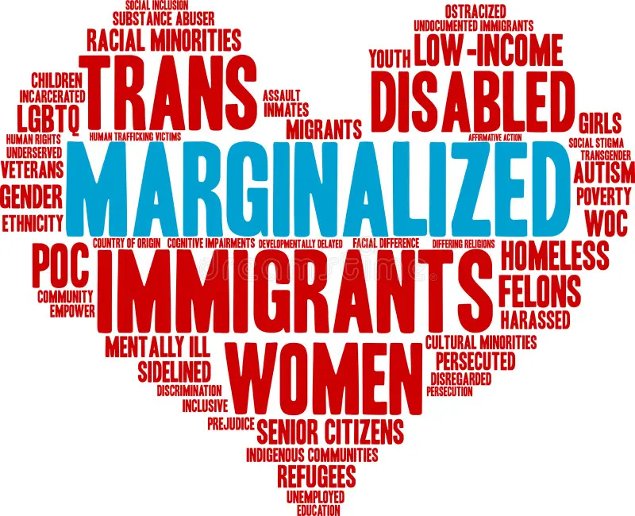
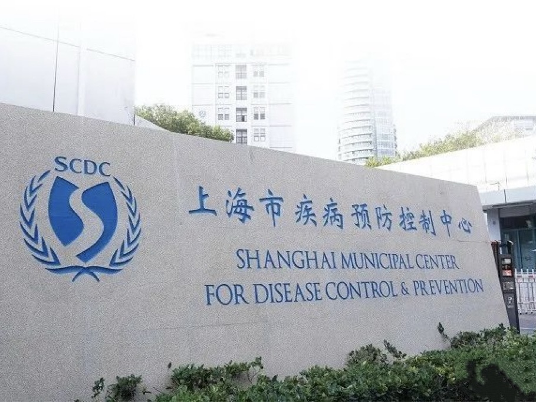
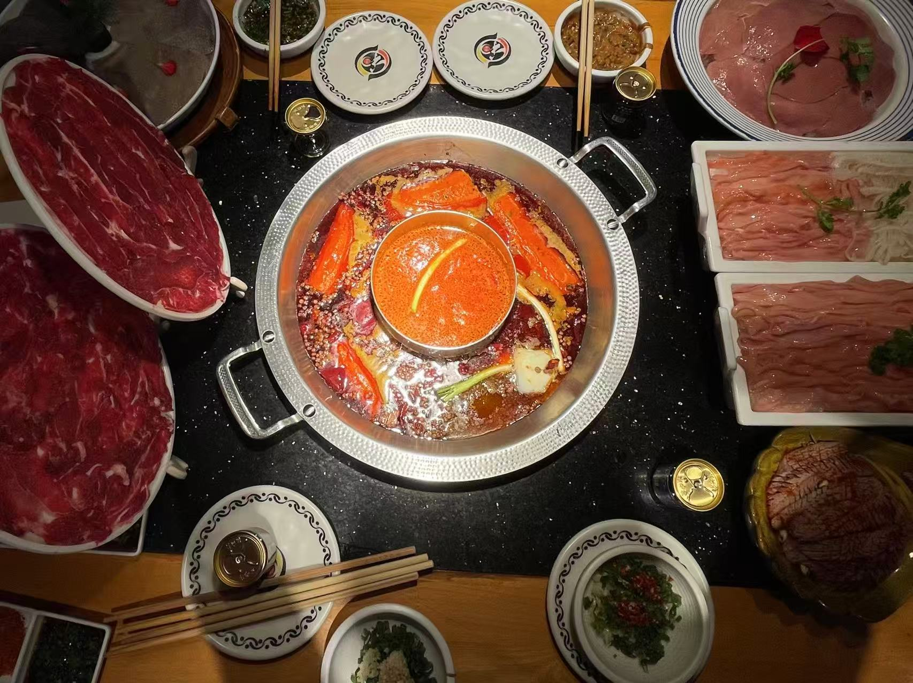

<!-- 页面样式：模块标题在上，下面左右排；隐藏图注；图片与文字顶边对齐 -->

# Get to Know Me

<!-- 模块 1：Educational Background -->
::: {.about-block}

Educational Background

::: {.about-row}
::: {.about-media}
{.about-img}
:::
::: {.about-text}
I earned my bachelor's degree from Northwest Agriculture and Forest University in Shaanxi Province, northwest China. My undergraduate major was Food Nutrition and Health, an interdisciplinary field combining medicine and engineering. However, as my studies progressed, I realized that addressing widespread health issues can often be achieved more effectively through behavioral interventions and health education at the population level than through individual treatment alone. This led me to choose public health as my field of study during my master's program.
:::
:::
:::

<!-- 模块 2：Professional Interests -->
::: {.about-block}

Professional Interests

::: {.about-row}
::: {.about-media}
{.about-img}
:::
::: {.about-text}
I am committed to improving health outcomes for marginalized populations—including migrant communities, low-income groups, and those facing structural barriers to care—and to advancing health equity through evidence-based public health practice. I am currently developing my analytical skillset in Python, R, and SQL in my coursework, with the goal of building a strong foundation for rigorous data management, statistical modeling, and reproducible workflows. Ultimately, I hope to become a data-driven policy analyst who can translate complex datasets into clear, actionable insights that inform equitable programs and practical policy solutions.
:::
:::
:::

<!-- 模块 3：Experience -->
::: {.about-block}

Experience

::: {.about-row}
::: {.about-media}
{.about-img}
:::
::: {.about-text}
During my senior year, I interned at the Shanghai Jiading CDC in the Environmental and Occupational Health Department. I participated in wastewater surveillance to monitor viral pathogens, assessed domestic and public-space water quality, and assisted with indoor air pollutant and radiation safety evaluations. Through this work, I saw firsthand how environmental exposures are unevenly distributed across communities and how structural conditions can shape health risks. This experience reinforced my commitment to health equity and highlighted the importance of using high-quality, well-contextualized data to identify patterns of exposure, target resources where they are most needed, and support more equitable public health decision-making.
:::
:::
:::

<!-- 模块 4：Food, Spice & Joy -->
::: {.about-block}

Beyond Academics

::: {.about-row}
::: {.about-media}
{.about-img}
:::
::: {.about-text}
Outside of coursework and field experiences, I have a deep passion for food as a source of both creativity and connection. Cooking and tasting new dishes bring me joy, and preparing meals is often how I unwind when I feel stressed or anxious. I especially love spicy food—hotpot is my favorite—not only for its flavors, but also for the way it brings people together around a shared table. For me, food is both nourishment and community.
:::
:::
:::
