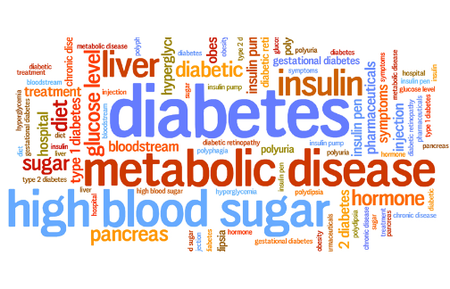
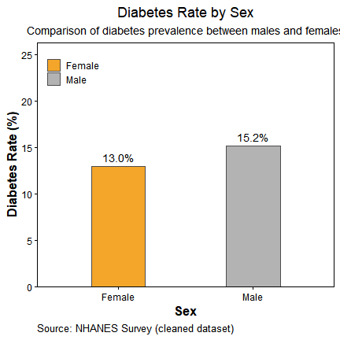
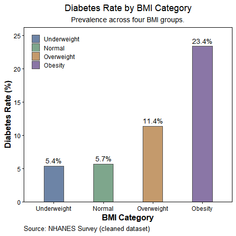
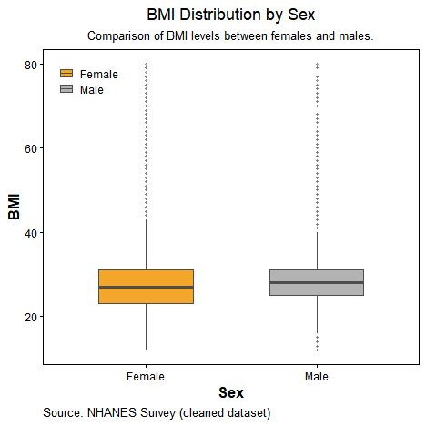
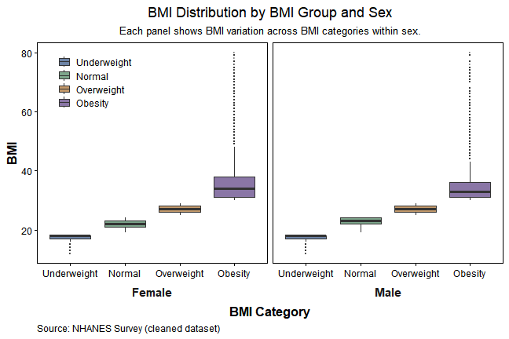
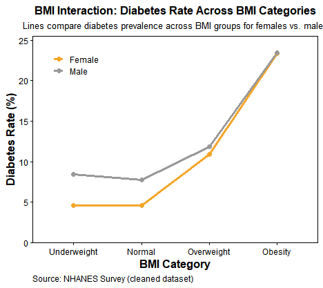

<style>
  .figure{
    display: block
  }
</style>

## Background

### 1. Research Question
Diabetes is a major public health concern in the United States, affecting more than 37 million Americans—approximately 1 in 10 adults—and its prevalence continues to rise alongside increases in obesity rates. Body Mass Index (BMI) is widely recognized as a strong predictor of diabetes risk, but this relationship may not be uniform across demographic groups. In particular, sex differences in biological factors, health behaviors, and healthcare access may modify how BMI contributes to diabetes risk. Therefore, this analysis seeks to investigate how BMI and sex are associated with the likelihood of having diabetes, and whether the association between BMI and diabetes differs between males and females. By examining both main effects and the BMI-by-sex interaction, this study aims to clarify whether BMI influences diabetes risk differently across sex groups.

<div class="figure" style="text-align: center">

<p class="caption">Figure 1. Word cloud of key concepts related to diabetes.</p>
</div>


### 2. Intended Audience
The intended audience includes students, researchers, and public health professionals who are interested in understanding how statistical data analysis can inform health policy and resource allocation decisions. Because diabetes prevention and management require substantial healthcare spending and targeted community health interventions, identifying population subgroups with elevated risk is essential for designing effective programs. This analysis demonstrates how reproducible data workflows and regression-based interpretation can support evidence-based decisions, guide early screening priorities, and highlight where prevention efforts may need to be adapted for different demographic groups.

### 3. Data Source
The data used in this analysis originate from the Behavioral Risk Factor Surveillance System (BRFSS), a health-related telephone survey administered annually by the U.S. Centers for Disease Control and Prevention (CDC). BRFSS is the largest continuously conducted health survey system in the world, collecting responses from over 400,000 adults each year on topics including health behaviors, chronic conditions, and preventive care usage. The survey has been conducted since 1984, and its highly standardized methodology makes it a key dataset for U.S. public health surveillance. For this project, a processed and publicly accessible version of the 2015 BRFSS dataset was obtained from Kaggle (Diabetes Health Indicators Dataset). The original 2015 BRFSS dataset contains responses from 441,455 individuals and includes 330 variables, representing either direct survey responses or derived indicators [@KaggleDiabetes].  
**Link to data:** https://www.kaggle.com/datasets/alexteboul/diabetes-health-indicators-dataset


::: {.column-margin}
**Quick note**  
- Largest ongoing US health survey (~400k adults/yr).  
- 2015 subset used here: *Diabetes Health Indicators* [@KaggleDiabetes].  
- Key vars: diabetes (Yes/No), BMI (kg/m²), sex (Female/Male).  
- We filter BMI to [10, 80] and form 4 groups.

:::


## Data Preparation
### 1. Data Dictionary

The table below describes the core variables used in this analysis after standardization. In later steps, variable names will be harmonized to ensure consistency across modeling and visualization [@Adu2019].


``` r
library(dplyr)
```

```
## 
## Attaching package: 'dplyr'
```

```
## The following objects are masked from 'package:stats':
## 
##     filter, lag
```

```
## The following objects are masked from 'package:base':
## 
##     intersect, setdiff, setequal, union
```

``` r
library(knitr)

data_dictionary <- tibble::tribble(
  ~Variable,   ~Type,        ~Units_or_Values,                 ~Description, 
  "diabetes",   "Binary",     "No / Yes",                       "Indicator of diabetes status (1 = diabetes, 0 = no diabetes), standardized to factor with levels No/Yes.",
  "bmi",        "Numeric",    "kg/m^2",                         "Body Mass Index, calculated from height and weight, treated as a continuous predictor.",
  "sex",        "Categorical","Female / Male",                  "Biological sex, standardized to a factor with two levels: Female and Male."
)

kable(data_dictionary, align = "l", caption = "Table1. Standardized Variable Definitions")
```


Table: Table1. Standardized Variable Definitions

|Variable |Type        |Units_or_Values |Description                                                                                              |
|:--------|:-----------|:---------------|:--------------------------------------------------------------------------------------------------------|
|diabetes |Binary      |No / Yes        |Indicator of diabetes status (1 = diabetes, 0 = no diabetes), standardized to factor with levels No/Yes. |
|bmi      |Numeric     |kg/m^2          |Body Mass Index, calculated from height and weight, treated as a continuous predictor.                   |
|sex      |Categorical |Female / Male   |Biological sex, standardized to a factor with two levels: Female and Male.                               |


### 2. Data Cleaning and Standardization

This section prepares the dataset for analysis by standardizing key variables and removing implausible values.


``` r
library(readr)
library(dplyr)
library(tidyr)
library(stringr)
library(purrr)
library(tibble)

df_raw <- read_csv("data/diabetes.csv", show_col_types = FALSE)

pick_col <- function(df, candidates) {
  nms <- names(df)
  idx <- purrr::detect_index(candidates, ~ any(tolower(nms) == tolower(.x)))
  if (idx == 0) NA_character_ else candidates[[idx]]
}

bmi_name <- pick_col(df_raw, c("BMI","bmi"))
sex_name <- pick_col(df_raw, c("Sex","sex","Gender","gender"))
dia_name <- pick_col(df_raw, c("Diabetes_binary","diabetes_binary","diabetes_012","diabetes"))

recode_diabetes <- function(x) {
  if (is.numeric(x)) {
    case_when(x == 1 ~ "Yes", x == 0 ~ "No", TRUE ~ NA_character_)
  } else {
    x_chr <- tolower(as.character(x))
    case_when(
      x_chr %in% c("1","yes","true","diabetic") ~ "Yes",
      x_chr %in% c("0","no","false","non-diabetic","non diabetic") ~ "No",
      TRUE ~ NA_character_
    )
  }
}

recode_sex <- function(x) {
  if (is.numeric(x)) {
    case_when(x == 0 ~ "Female", x == 1 ~ "Male", TRUE ~ NA_character_)
  } else {
    x_chr <- str_trim(tolower(as.character(x)))
    case_when(
      x_chr %in% c("f","female","woman","women") ~ "Female",
      x_chr %in% c("m","male","man","men") ~ "Male",
      TRUE ~ NA_character_
    )
  }
}

prep <- df_raw %>%
  mutate(
    bmi = suppressWarnings(as.numeric(.data[[bmi_name]])),
    sex = factor(recode_sex(.data[[sex_name]]), levels = c("Female","Male")),
    diabetes = factor(recode_diabetes(.data[[dia_name]]), levels = c("No","Yes"))
  )

clean <- prep %>%
  filter(bmi >= 10, bmi <= 80) %>%
  drop_na(diabetes, bmi, sex) %>%
  transmute(
    diabetes = diabetes,
    bmi = as.numeric(bmi),
    sex = droplevels(sex),
    bmi_group = cut(
      bmi,
      breaks = c(-Inf, 18.5, 25, 30, Inf),
      labels = c("Underweight","Normal","Overweight","Obesity"),
      right = FALSE
    )
  )

clean
```

```
## # A tibble: 253,401 × 4
##    diabetes   bmi sex    bmi_group 
##    <fct>    <dbl> <fct>  <fct>     
##  1 No          40 Female Obesity   
##  2 No          25 Female Overweight
##  3 No          28 Female Overweight
##  4 No          27 Female Overweight
##  5 No          24 Female Normal    
##  6 No          25 Male   Overweight
##  7 No          30 Female Obesity   
##  8 No          25 Female Overweight
##  9 Yes         30 Female Obesity   
## 10 No          24 Male   Normal    
## # ℹ 253,391 more rows
```

``` r
summary(clean)
```

```
##  diabetes          bmi            sex               bmi_group    
##  No :218096   Min.   :12.00   Female:141772   Underweight: 3127  
##  Yes: 35305   1st Qu.:24.00   Male  :111629   Normal     :68953  
##               Median :27.00                   Overweight :93749  
##               Mean   :28.32                   Obesity    :87572  
##               3rd Qu.:31.00                                      
##               Max.   :80.00
```

``` r
nrow(clean)
```

```
## [1] 253401
```

``` r
table(clean$bmi_group)
```

```
## 
## Underweight      Normal  Overweight     Obesity 
##        3127       68953       93749       87572
```
::: callout-tip
**Why trim BMI to [10, 80]?**  
Extreme BMI values in BRFSS are rare and typically reflect entry or recall errors.  
Trimming to a plausible range reduces leverage from outliers and stabilizes group summaries, without materially changing the distribution inside each BMI category.
:::

## Data Analysis
### 1. Main Effects: Sex and BMI on Diabetes Rate

::: callout-note
This section focuses on the main effects of sex and BMI on diabetes prevalence. We first compare diabetes rates between females and males to determine whether sex alone is associated with differences in diabetes risk. Then, we examine how diabetes prevalence varies across BMI categories, allowing us to see how increasing body weight relates to the likelihood of having diabetes. These exploratory visualizations provide a clear foundation for understanding each factor's independent contribution before considering more complex relationships.
:::


#### 1.1 Sex 

We compare diabetes prevalence between females and males using a bar chart. This visualization highlights the main effect of sex on diabetes risk by showing the proportion of individuals diagnosed with diabetes in each group [@KautzkyWiller2016].

<div class="figure" style="text-align: center">

<p class="caption">Figure 2. Diabetes prevalence by sex.</p>
</div>


#### 1.2 BMI

Similarly, we compare diabetes prevalence across four BMI categories using a bar chart [@Zhao2021].

<div class="figure" style="text-align: center">

<p class="caption">Figure 3. Diabetes prevalence across BMI categories.</p>
</div>

#### 1.3 Interpretation of Main Effects   

The bar chart comparing diabetes rate by sex indicates that males have a higher prevalence of diabetes (15.2%) than females (13.0%). Although the difference is not extremely large, it is consistent with findings in epidemiological literature suggesting that men tend to exhibit greater metabolic risk profiles, potentially due to higher visceral fat accumulation and lower health-seeking behavior. The plot of diabetes rate by BMI category shows a clear monotonic increasing trend. Individuals classified as Underweight and Normal weight have similarly low diabetes rates (5.4% and 5.7%, respectively). The prevalence increases noticeably in the Overweight group (11.4%), and rises sharply among those with Obesity (23.4%), more than four times the rate observed in the normal-weight population. These results suggest that BMI is a strong predictor of diabetes risk, with the association showing a dose–response pattern. Compared to BMI, sex exhibits a weaker but still visible main effect. This suggests that body weight status is a more influential determinant of diabetes prevalence in this dataset.

### 2. Interaction Between Sex and BMI

::: callout-note
This section examines whether the relationship between BMI and diabetes differs between males and females. We first inspect the distribution of BMI across sex groups to evaluate potential structural differences. Then, we assess whether diabetes prevalence varies jointly by sex and BMI, providing visual and statistical evidence of an interaction effect.
:::

#### 2.1 BMI Distribution by Sex

We compare BMI distributions between females and males using boxplots to examine whether the two groups differ in average BMI or variability. This helps us assess whether sex-related differences in BMI may contribute to differences in diabetes risk and ensures that BMI is on a comparable scale across groups before modeling.

<div class="figure" style="text-align: center">

<p class="caption">Figure 4. BMI distribution by sex.</p>
</div>


#### 2.2 BMI Distribution Across BMI Categories, Faceted by Sex

This faceted boxplot displays BMI distributions for females and males across the four BMI categories. Each panel represents one sex, showing how BMI values vary within each group. This provides structural context on BMI composition before examining its relationship with diabetes.

::: {.column-page}
<div class="figure" style="text-align: center">

<p class="caption">Figure 5. BMI distribution across BMI categories, faceted by sex.</p>
</div>
:::


#### 2.3 Interaction Plot: Diabetes Rate Across Sex × BMI Groups

This is an interaction line plot. It shows how diabetes prevalence changes across BMI categories separately for females and males. If the two lines are not parallel, this indicates a Sex × BMI interaction — meaning the effect of BMI on diabetes risk differs by sex.

<div class="figure" style="text-align: center">

<p class="caption">Figure 6. Diabetes rate across BMI categories by sex (interaction plot).</p>
</div>


#### 2.4 Interpratation of Interaction

Figure 3 compares BMI distributions between females and males and shows that males generally have slightly higher BMI and a wider spread, indicating baseline structural differences between sex groups. Figure 4 further breaks BMI down into four BMI categories and facets the distributions by sex, showing that even within the same BMI category, males and females differ in median BMI and variability. This means that being in the same BMI group does not imply identical BMI profiles across sexes. Figure 5 then examines diabetes prevalence across BMI categories for each sex. Both groups show increasing diabetes rates with higher BMI, but the slopes differ, suggesting that the strength of the BMI–diabetes relationship is not the same for males and females.  

Overall, the three figures support the presence of a Sex × BMI interaction. Sex groups differ not only in their overall BMI levels, but also in how BMI is distributed within BMI categories, and ultimately, in how BMI relates to diabetes risk. Because the relationship between BMI and diabetes is steeper for one sex than the other, the effect of BMI on diabetes cannot be assumed to be uniform across sexes. Therefore, statistical modeling should include an interaction term to accurately capture this joint effect.

### 3. Statistical Testing: Two-Way ANOVA (F-Test)

::: callout-note
While the descriptive plots show that diabetes prevalence tends to be higher among males than females, and increases substantially across BMI categories, visual interpretation alone does not establish whether these differences are statistically meaningful. To determine whether the observed patterns reflect true population-level effects rather than random sample variation, we apply a two-way ANOVA (F-test) with sex and BMI group as factors. This allows us to simultaneously test the main effect of sex, the main effect of BMI category, and the Sex × BMI interaction, which assesses whether the influence of BMI on diabetes prevalence differs between males and females. Conducting this inferential test provides a rigorous basis for evaluating whether the trends suggested by the exploratory visualizations represent statistically significant relationships.
:::


#### 3.1 Model Specification and ANOVA Output


``` r
library(dplyr)

dat_anova <- clean %>%
transmute(
diabetes_num = as.numeric(diabetes == "Yes"),
sex = factor(sex, levels = c("Female","Male")),
bmi_group = factor(bmi_group, levels = c("Underweight","Normal","Overweight","Obesity"))
) %>%
na.omit()

fit_aov <- aov(diabetes_num ~ sex * bmi_group, data = dat_anova)

summary(fit_aov)
```

```
##                   Df Sum Sq Mean Sq F value Pr(>F)    
## sex                1     30    30.0  261.69 <2e-16 ***
## bmi_group          3   1319   439.6 3837.32 <2e-16 ***
## sex:bmi_group      3      9     3.0   26.34 <2e-16 ***
## Residuals     253393  29028     0.1                   
## ---
## Signif. codes:  0 '***' 0.001 '**' 0.01 '*' 0.05 '.' 0.1 ' ' 1
```

``` r
anova(fit_aov)
```

```
## Analysis of Variance Table
## 
## Response: diabetes_num
##                   Df  Sum Sq Mean Sq  F value    Pr(>F)    
## sex                1    30.0   29.98  261.695 < 2.2e-16 ***
## bmi_group          3  1318.8  439.60 3837.323 < 2.2e-16 ***
## sex:bmi_group      3     9.1    3.02   26.339 < 2.2e-16 ***
## Residuals     253393 29028.3    0.11                       
## ---
## Signif. codes:  0 '***' 0.001 '**' 0.01 '*' 0.05 '.' 0.1 ' ' 1
```

#### 3.2 Two-Way ANOVA Summary Table
<table class="table" style="font-size: 18px; width: auto !important; margin-left: auto; margin-right: auto;">
<caption style="font-size: initial !important;">Table 2. Two-way ANOVA Summary for Diabetes Prevalence</caption>
 <thead>
  <tr>
   <th style="text-align:left;font-weight: bold;background-color: rgba(242, 242, 242, 255) !important;"> Term </th>
   <th style="text-align:right;font-weight: bold;background-color: rgba(242, 242, 242, 255) !important;"> Df </th>
   <th style="text-align:right;font-weight: bold;background-color: rgba(242, 242, 242, 255) !important;"> Sum Sq </th>
   <th style="text-align:right;font-weight: bold;background-color: rgba(242, 242, 242, 255) !important;"> Mean Sq </th>
   <th style="text-align:right;font-weight: bold;background-color: rgba(242, 242, 242, 255) !important;"> F value </th>
   <th style="text-align:right;font-weight: bold;background-color: rgba(242, 242, 242, 255) !important;"> Pr(&gt;F) </th>
  </tr>
 </thead>
<tbody>
  <tr>
   <td style="text-align:left;"> A: Sex </td>
   <td style="text-align:right;"> 1 </td>
   <td style="text-align:right;"> 29.9794 </td>
   <td style="text-align:right;"> 29.979421 </td>
   <td style="text-align:right;"> 261.70 </td>
   <td style="text-align:right;"> 0 </td>
  </tr>
  <tr>
   <td style="text-align:left;"> B: BMI group </td>
   <td style="text-align:right;"> 3 </td>
   <td style="text-align:right;"> 1318.7937 </td>
   <td style="text-align:right;"> 439.597893 </td>
   <td style="text-align:right;"> 3837.32 </td>
   <td style="text-align:right;"> 0 </td>
  </tr>
  <tr>
   <td style="text-align:left;"> A × B </td>
   <td style="text-align:right;"> 3 </td>
   <td style="text-align:right;"> 9.0519 </td>
   <td style="text-align:right;"> 3.017306 </td>
   <td style="text-align:right;"> 26.34 </td>
   <td style="text-align:right;"> 0 </td>
  </tr>
  <tr>
   <td style="text-align:left;"> Residuals </td>
   <td style="text-align:right;"> 253393 </td>
   <td style="text-align:right;"> 29028.3190 </td>
   <td style="text-align:right;"> 0.114558 </td>
   <td style="text-align:right;"> NA </td>
   <td style="text-align:right;"> NA </td>
  </tr>
  <tr>
   <td style="text-align:left;"> Total </td>
   <td style="text-align:right;"> 253400 </td>
   <td style="text-align:right;"> 30386.1440 </td>
   <td style="text-align:right;"> NA </td>
   <td style="text-align:right;"> NA </td>
   <td style="text-align:right;"> NA </td>
  </tr>
</tbody>
</table>


#### 3.3 Interpretation of Results

The two-way ANOVA results show that both sex and BMI group have statistically significant main effects on diabetes prevalence (p < 0.001), confirming that males exhibit higher diabetes rates than females and that diabetes risk increases sharply across BMI categories. Importantly, although the interaction plot suggested largely parallel trends across sexes—implying no strong visual interaction—the ANOVA indicates that the Sex × BMI interaction is statistically significant (p < 0.001). This means that the influence of BMI on diabetes risk differs slightly between males and females, even if the difference was not visually prominent. However, the magnitude of this interaction is much smaller than the main effect of BMI, which remains the dominant predictor. Overall, these findings indicate that BMI strongly drives diabetes risk, sex has a smaller but meaningful effect, and the relationship between BMI and diabetes varies modestly by sex—justifying the inclusion of both main effects and the interaction term in further modeling.

## Summary of Findings
In summary, this analysis examined how sex and BMI are associated with diabetes prevalence and whether these factors interact in shaping diabetes risk. Both descriptive visualizations and two-way ANOVA results showed that BMI is a strong predictor of diabetes, with prevalence rising sharply from normal weight to obesity categories. Sex also demonstrated a significant, though smaller, main effect, with males exhibiting higher rates of diabetes than females. Additionally, a statistically significant Sex × BMI interaction indicates that the strength of the BMI–diabetes relationship differs slightly between males and females. Overall, these findings suggest that weight status plays the primary role in diabetes risk, but sex-specific differences should be acknowledged when designing screening guidelines and public health interventions.

## Functions Used

**dplyr**  
- `mutate()` — create/transform variables  
- `group_by()` — group data for summaries  
- `summarize()` — compute grouped summaries  
- `transmute()` — keep only transformed variables  
- `filter()` — row filtering  
- `case_when()` — conditional recoding  
- `recode()` — relabel factor/character values

**tidyr**  
- `drop_na()` — remove rows with missing values

**ggplot2**  
- `ggplot()` + `aes()` — initialize plots and mappings  
- Geoms: `geom_col()`, `geom_text()`, `geom_boxplot()`, `geom_line()`, `geom_point()`  
- Scales: `scale_fill_manual()`, `scale_color_manual()`, `scale_y_continuous()` (with `expansion()`)  
- Labels & theme: `labs()`, `theme_classic()`, `theme()`, `element_rect()`, `element_blank()`, `element_text()`  
- Faceting: `facet_grid()`


## References
