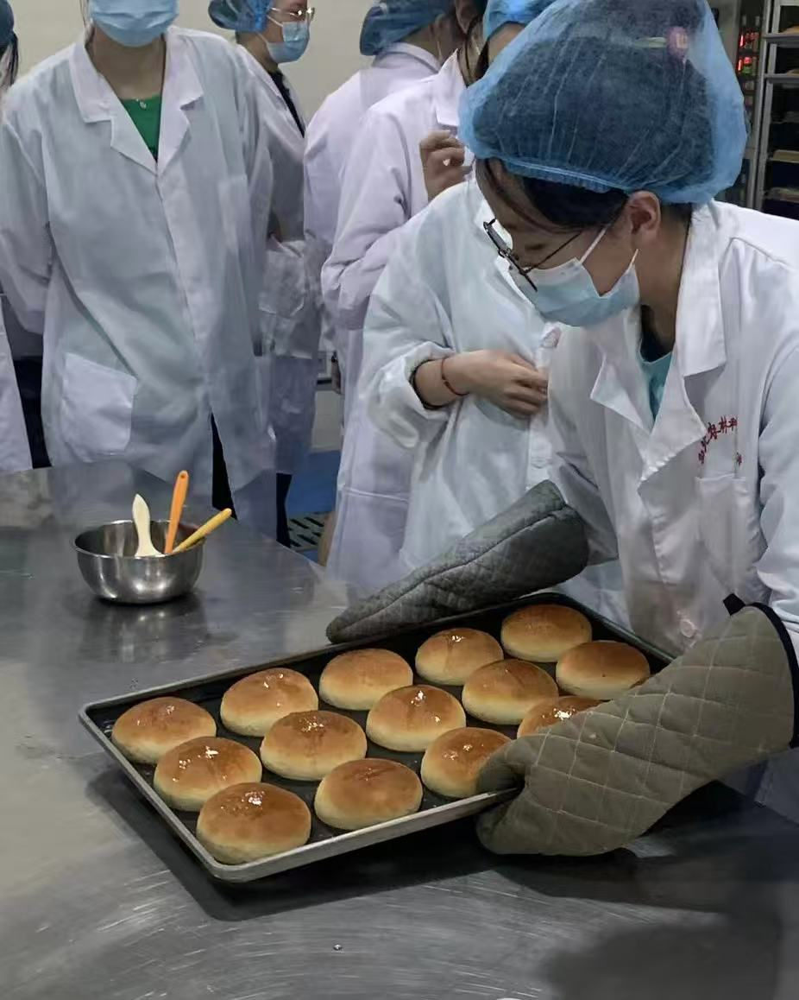

# Yixin Xue

::: {.container style="display: flex; align-items: center; justify-content: center; gap: 30px;"}

{fig-alt="Yixin baking bread rolls" width="40%" style="border-radius: 12px;"}

Hello Everyone! I am a first year MHS student in Health, Behavior and Society.  
My research interests focus on data-driven policy analysis to address health inequities  
and improve outcomes for marginalized populations.  
In my free time, I enjoy exploring esports, spending time outdoors, and baking.

:::
